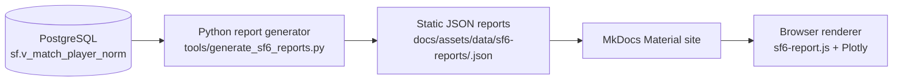

# Street Fighter 6 Matchup Lab

A static-site matchup report tool built from real ranked match data — designed to be shareable for friends (CFN links) and solid as a data + product case study.

[Open the Matchup Report →](matchup-report.md){ .md-button .md-button--primary }
[Architecture →](architecture.md){ .md-button }

---

## What you can do here

- Generate a **player-specific report** from offline-computed ranked data
- See **top 5 / bottom 5 matchups** (no scroll tables)
- Get a coaching-style takeaway: **“If you fixed one matchup…”**
- Explore Plotly charts (cumulative matchup curves, baseline at 50%)

> Tip: You can share a report by copying the page link after loading a CFN (the URL includes `?cfn=`).

---

## Why it’s built this way

### Static, deterministic, deploy-friendly
Reports are generated offline and shipped as JSON. The site stays fast, cacheable, and predictable for builds and deploys.

### Python-first analytics
All calculations happen in Python. The browser’s job is rendering: fetch JSON → update UI → draw Plotly charts.

### Ranked MR only (not LP)
Analysis is intentionally scoped to ranked matches with valid MR. Out-of-scope values are filtered (e.g., MR > 2500).

---

## Technical architecture (at a glance)

