# Street Fighter 6 Matchup Lab

Outside of my family and my work I try to get some video games in a few times per week after the kids are asleep. Once or twice a month I'll even go to the arcade and play in person.

My latest obsession has been fighting games, and in this case **Street Fighter VI**. I've built a headless webscraper to obtain match history for all my local Street Fighter colleagues and they can come here to get an update on some stats.

I've outlined the architecture and explained it more within, but it comes down to wanting to highlight how data can be valuable in your pursuit to improve at almost anything. Fighting games are extremely competitive, and anything you can work in to build that edge is worth it.

[Open the Matchup Report →](matchup-report.md){ .md-button .md-button--primary }
[Architecture →](architecture.md){ .md-button }

---

## How it works

```mermaid
graph LR
  A["🎮 Buckler<br/>Headless Browser"]
  B["� PostgreSQL<br/>Match History"]
  C["⚙️ Python<br/>Report Generator"]
  D["📄 Static JSON<br/>Reports"]
  E["📊 Browser<br/>Plotly Charts"]
  
  A -->|Scrape CFN| B
  B -->|SQL queries| C
  C -->|Offline transforms| D
  D -->|On load| E
  
  classDef stage fill:#2c8c89,stroke:#1a5653,stroke-width:2px,color:#fff
  class A,B,C,D,E stage
```

---

## What you can do here

- Generate a **player-specific report** from offline-computed ranked data
- See **top 5 / bottom 5 matchups** (no scroll tables)
- Get a coaching-style takeaway: **“If you fixed one matchup…”**
- Explore Plotly charts (cumulative matchup curves, baseline at 50%)

> **CFN** = Capcom Fighter Network ID. Tip: After generating a report, you can share it by copying the page URL—it includes `?cfn=` so your friend gets the same results.

---

## Why it’s built this way

**Static, deterministic, lightning-fast** – Reports ship as JSON. No compute on load, always consistent, easy to deploy and cache.

**Python handles the heavy lifting** – All calculations auditable in code. The browser's job is simple: fetch → render → visualize.

**Always fresh** – Reports regenerate periodically from the latest match history; check the timestamp in your report.